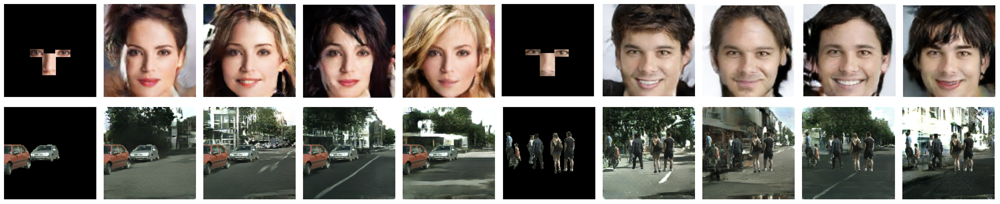
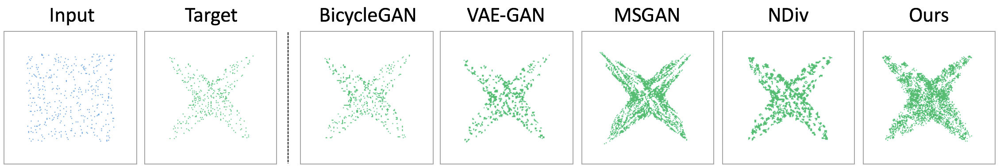

# Multimodal Image Outpainting
This is a Pytorch implementation of our paper "Multimodal Image Outpainting". 

[Multimodal Image Outpainting With Regularized Normalized Diversification](http://openaccess.thecvf.com/content_WACV_2020/papers/Zhang_Multimodal_Image_Outpainting_With_Regularized_Normalized_Diversification_WACV_2020_paper.pdf) <br />
[Lingzhi Zhang](https://owenzlz.github.io/), Jiancong Wang, [Jianbo Shi](https://www.cis.upenn.edu/~jshi/)  <br />
GRASP Laboratory, University of Pennsylvania

In Winter Conference on Applications of Computer Vision (WACV), 2020.

## Introduction

We study the problem of generating a set of realistic and diverse backgrounds when given only a small foreground region, which we formulate as image outpainting task. We propose a generative model by improving the normalized diversification framework to encourage diverse sampling in this conditional synthesis task. The results show that our proposed approach can produce more diverse images with similar or better quality compare to the state-of-the-arts methods.



## Usage

The synthetic experiment and real image experiment codes are in the folder "synthetic_data" and "real_image" respectively. 


## Synthetic Results Comparison



## Face Examples


## Street Scene Examples


## Citation
If you use this code for your research, please cite our [paper](https://arxiv.org/abs/1910.11481):

```
@inproceedings{zhang2020multimodal,
  title={Multimodal Image Outpainting With Regularized Normalized Diversification},
  author={Zhang, Lingzhi and Wang, Jiancong and Shi, Jianbo},
  booktitle={The IEEE Winter Conference on Applications of Computer Vision},
  pages={3433--3442},
  year={2020}
}
```
